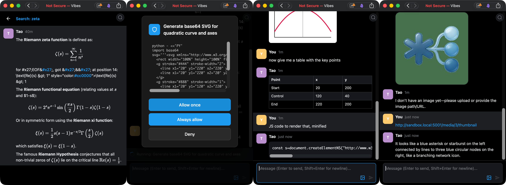

# Vibes


A single-user, mobile-friendly SPA for Slack-like interactions with coding agents via the ACP protocol. Heavily inspired by [Toad](https://github.com/batrachianai/toad)'s ACP implementation, (which is stellar), but aimed at providing my own mobile agent interface over Tailscale.



## Features

- Persistent, infinite scrolling conversations with ACP agents
- Accept/Deny tool usage by agents, with command previews
- Live reasoning/intent updates via Server-Sent Events (SSE)
- Post text, links, images, and files
- Rich media previews (downscaled and stored in database)
- KaTeX maths and SVG image support
- API endpoints for predefined custom actions/prompts
- Full-text search using `sqlite` FTS
- Responsive design for mobile, tablet, and desktop
- Dark/light mode

## Non-Features

- Authentication (use `authelia` or an authenticating reverse proxy)
- Security (use `traefik` or Tailscale)
- Multiple users (should be trivial to add)

## Roadmap

- [ ] Better integration with multimodal models (ACP punts on that right now)
- [ ] Slash commands
- [ ] Switching agents/models

## Installation

```bash
# Install directly from GitHub
pip install -U git+https://github.com/rcarmo/vibes.git

# Install a specific tag
pip install -U "vibes @ git+https://github.com/rcarmo/vibes.git@v0.1.0"

# Or with uv (faster alternative, installs as isolated tool)
uv tool install git+https://github.com/rcarmo/vibes.git

# Install a specific tag with uv
uv tool install "vibes @ git+https://github.com/rcarmo/vibes.git@v0.1.0"
```

Or for development:

```bash
git clone https://github.com/rcarmo/vibes.git
cd vibes
pip install -e ".[dev]"
```

## Usage

```bash
# Run the server
vibes

# Or with custom options
VIBES_HOST=127.0.0.1 VIBES_PORT=3000 vibes
```

## Configuration

See [docs/CONFIGURATION.md](docs/CONFIGURATION.md).

## API Endpoints

See [docs/API.md](docs/API.md).

## Development

```bash
# Install dev dependencies
pip install -e ".[dev]"

# Run tests
python -m pytest

# Run frontend linting (requires bun)
make lint-frontend

# Run with make
make serve
```

## License

MIT
