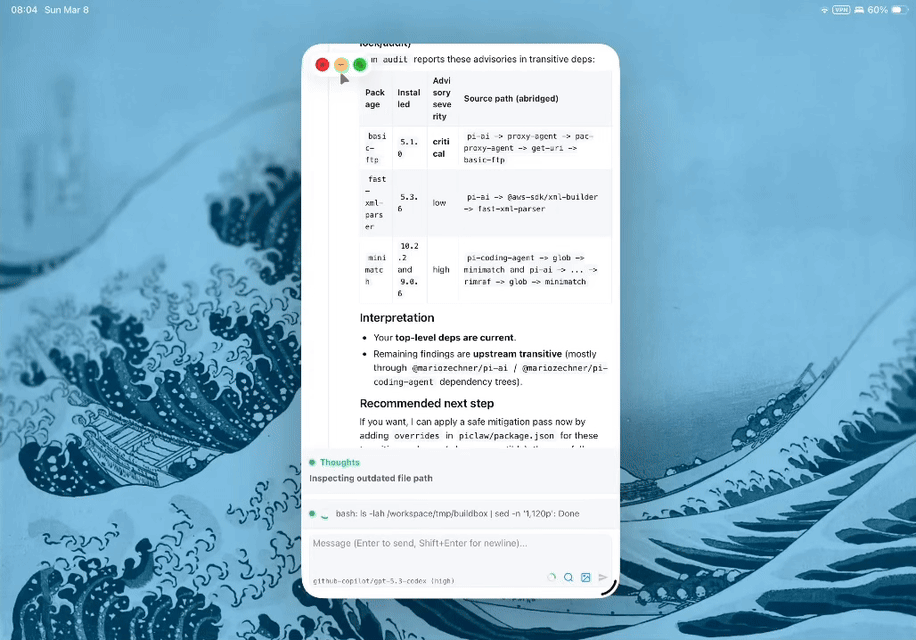

# Vibes

[](https://github.com/rcarmo/vibes/actions/workflows/ux-tests.yml)
[](https://github.com/rcarmo/vibes/actions/workflows/ci.yml)

A mobile-friendly web UI for coding agents, written in Go. Ships as a single static binary (~24 MB) with zero runtime dependencies.

Supports four [ACP](https://agentclientprotocol.com/) agents and [Pi](https://pi.dev) native RPC. Built for personal use over Tailscale.



> **This is the Go port** — single binary, embedded frontend, pure-Go SQLite.  
> The original Python implementation is on the [`python`](https://github.com/rcarmo/vibes/tree/python) branch.

---

## Features

- **Streaming chat** — real-time SSE with Markdown, KaTeX, and Mermaid rendering
- **Workspace explorer** — file tree with previews, drag-and-drop upload, folder downloads (ZIP)
- **Code editor** — tabbed CodeMirror 6 editor (13 languages, Vim mode, search/replace, pop-out windows)
- **Agent controls** — approve/deny tool calls, queue follow-ups, mid-turn steering, slash commands
- **Rich media** — paste images, attach files, OpenGraph link previews
- **SQLite storage** — messages, media, and full-text search in a single file
- **PWA** — installable, dark/light themes, responsive from phone to desktop
- **Single binary** — no Python, no Node.js, no virtualenv, no runtime dependencies
- **Extension system** — backend routes, SSE events, and frontend UI panels
- **Multi-agent** — switch between Copilot, Codex, Claude, OpenCode, and Pi at runtime

---

## Verified ACP agents

| Agent | Binary | Version | Status |
|---|---|---|---|
| **GitHub Copilot** | `copilot-language-server --acp --stdio` | v1.472.0 | ✅ |
| **OpenAI Codex** | `codex-acp` | v0.11.1 | ✅ |
| **Claude** | `claude-agent-acp` | v0.29.2 | ✅ |
| **Pi** | `pi-acp` | v0.0.26 | ✅ |
| **OpenCode** | `opencode acp` | v1.14.31 | ✅ |

### Capability matrix

| Feature | Copilot | Codex | Claude | Pi | OpenCode |
|---|---|---|---|---|---|
| Image support | ✅ | ✅ | ✅ | ✅ | ✅ |
| Embedded context | ✅ | ✅ | ✅ | — | ✅ |
| MCP support | — | ✅ (HTTP) | ✅ (HTTP + SSE) | — | ✅ (HTTP + SSE) |
| Session list/close | ✅ | ✅ | ✅ | ✅ | ✅ |
| Session fork/resume | — | — | ✅ | — | ✅ |
| Prompt queueing | — | — | ✅ | — | — |
| Free models | — | — | — | — | ✅ |
| Auth | GitHub OAuth | ChatGPT / API key | Pre-configured | Terminal login | `opencode auth` |

All five implement ACP protocol v1 over stdio JSON-RPC. OpenCode provides free models (gpt-5-nano, hy3-preview-free, etc.) making it ideal for CI testing. Pi also supports a richer native RPC mode with streaming drafts, thinking traces, tool events, and live model control.

---

## Quick start

```bash
# Build
git clone https://github.com/rcarmo/vibes.git && cd vibes
make build

# Run with GitHub Copilot (default)
./vibes

# Run with any ACP agent
VIBES_ACP_AGENT="codex-acp" ./vibes
VIBES_ACP_AGENT="claude-agent-acp" ./vibes
VIBES_ACP_AGENT="pi-acp" ./vibes
VIBES_ACP_AGENT="opencode acp" ./vibes     # free models available

# Run with Pi native RPC (richer features)
VIBES_DEFAULT_AGENT=pi ./vibes

# Open in browser
open http://localhost:8080
```

---

## Installation

### From source (recommended)

```bash
make build    # bun install → bun run build.js → go build
```

This produces a **fully self-contained binary** with all HTML, CSS, JS, fonts, and icons embedded at compile time via `//go:embed`.

### Cross-compile

```bash
make build-linux-arm64    # Raspberry Pi, ARM Proxmox
make build-darwin-arm64   # macOS Apple Silicon
make build-all            # all platforms
```

### Docker

```bash
# Local build
docker build -t vibes .
docker run -p 8080:8080 vibes

# Prebuilt release images from GHCR
docker pull ghcr.io/rcarmo/vibes:vX.Y.Z
docker run -p 8080:8080 ghcr.io/rcarmo/vibes:vX.Y.Z
```

The Dockerfile produces a **scratch-based image** (~24 MB) — just the binary + CA certificates.
Release tags publish multi-arch images (`linux/amd64`, `linux/arm64`) to GHCR.

### Agent binaries

Install the ACP agents you want to use:

```bash
npm install -g @github/copilot-language-server    # GitHub Copilot
npm install -g @openai/codex                       # OpenAI Codex (includes codex-acp)
npm install -g @agentclientprotocol/claude-agent-acp  # Claude
npm install -g pi-acp                              # Pi (ACP adapter)
npm install -g opencode-ai                         # OpenCode (free models)
npm install -g @mariozechner/pi-coding-agent       # Pi (native, for RPC mode)
```

---

## Configuration

All configuration is via environment variables with `VIBES_` prefix:

| Variable | Default | Description |
|---|---|---|
| `VIBES_HOST` | `0.0.0.0` | Bind address |
| `VIBES_PORT` | `8080` | Port |
| `VIBES_DB_PATH` | `database/vibes.db` | SQLite database |
| `VIBES_DEBUG` | `false` | Verbose logging |
| `VIBES_ACP_AGENT` | `copilot-language-server --acp --stdio` | ACP agent command |
| `VIBES_DEFAULT_AGENT` | `acp` | Default agent (`acp` or `pi`) |
| `VIBES_PI_ENABLED` | `false` | Enable Pi native RPC |
| `VIBES_PI_AGENT` | `pi` | Pi binary path |
| `VIBES_PERMISSION_TIMEOUT` | `30` | Permission request timeout (seconds) |
| `VIBES_PERMISSION_AUTO_APPROVE` | `false` | Auto-approve all tool calls |
| `VIBES_DISCONNECT_TIMEOUT` | `300` | Agent keepalive after last SSE client disconnects |
| `VIBES_ACP_DEBUG` | `false` | Wire-level ACP logging |
| `VIBES_EXTENSIONS_DIR` | `extensions` | Extension scan directory |
| `VIBES_CORS_ALLOW_ORIGIN` | _(unset)_ | Enable CORS for a specific origin (or `*`) |
| `VIBES_API_TOKEN` | _(unset)_ | Optional API token for sensitive/mutating routes (`X-API-Token` or `Authorization: Bearer`) |
| `VIBES_ENABLE_TERMINAL` | `false` | Enable terminal WebSocket endpoint (`/terminal/ws`) |
| `VIBES_ENABLE_PPROF` | `false` | Enable pprof endpoints under `/debug/pprof` (guarded by token when set) |

See [docs/CONFIGURATION.md](docs/CONFIGURATION.md) for full reference.

### Security hardening (recommended for remote deployments)

```bash
# Require token auth on sensitive/mutating endpoints
export VIBES_API_TOKEN="change-me"

# Restrict browser CORS to your UI origin
export VIBES_CORS_ALLOW_ORIGIN="https://your-ui.example"

# Keep dangerous debug/shell surfaces disabled unless needed
export VIBES_ENABLE_TERMINAL=false
export VIBES_ENABLE_PPROF=false
```


---

## Architecture

### System diagram

```
┌─────────────────────────────────────────────────────────────────┐
│                         Browser (SPA)                            │
│  Preact + HTM │ CodeMirror 6 │ KaTeX │ Mermaid │ SSE client     │
└────────────────────────────────┬────────────────────────────────┘
                                 │ HTTP + SSE
┌────────────────────────────────┴────────────────────────────────┐
│                       Go HTTP Server (chi)                        │
│                                                                  │
│  ┌──────────┐ ┌──────────┐ ┌──────────┐ ┌──────────┐           │
│  │ Timeline │ │  Media   │ │Workspace │ │  Agents  │           │
│  │  Routes  │ │  Routes  │ │  Routes  │ │  Routes  │           │
│  └────┬─────┘ └────┬─────┘ └────┬─────┘ └────┬─────┘           │
│       │             │            │             │                  │
│  ┌────┴─────────────┴────────────┴─────────────┴──────────────┐  │
│  │              SQLite (WAL, FTS5, JSON columns)               │  │
│  └─────────────────────────────────────────────────────────────┘  │
│                                                                  │
│  ┌───────────────┐        ┌────────────────────────────────────┐  │
│  │   SSE Broker  │◄──────►│         Agent Registry             │  │
│  │  (per-client  │        │  ┌─────────┐  ┌─────────┐         │  │
│  │   buffered    │        │  │   ACP   │  │   Pi    │         │  │
│  │   fanout)     │        │  │Provider │  │Provider │         │  │
│  └───────────────┘        │  └────┬────┘  └────┬────┘         │  │
│                            │       │            │               │  │
│  ┌───────────────┐        │  ┌────┴────────────┴────┐         │  │
│  │  Extensions   │        │  │  Subprocess Manager   │         │  │
│  │  (registry)   │        │  └────┬─────────────────┘         │  │
│  └───────────────┘        └───────┼────────────────────────────┘  │
└───────────────────────────────────┼──────────────────────────────┘
                                    │ stdio (JSON-RPC / NDJSON)
                   ┌────────────────┼────────────────┐
                   ▼                ▼                ▼
          ┌──────────────┐  ┌────────────┐  ┌────────────┐
          │copilot-lang- │  │  codex-acp │  │claude-agent│
          │server --acp  │  │            │  │   -acp     │
          └──────────────┘  └────────────┘  └────────────┘
                                    │
                            ┌───────┴────────┐
                            │   pi --mode    │
                            │     rpc        │
                            └────────────────┘
```

### Request flow: user message → agent response

```
1. User types message in compose box
2. Frontend POSTs to /agent/default/message
3. Server stores user message in SQLite
4. Server broadcasts "new_post" via SSE
5. Server spawns prompt on the active AgentProvider (async)
6. Agent streams events on stdout:
   - ACP: session/update notifications (draft/thought/tool_call)
   - Pi: NDJSON events (text_delta/thinking_delta/tool_execution)
7. Provider routes events → SSE broker → all connected clients
8. Frontend renders streaming draft/thought/status panels
9. Agent completes turn → final response stored in SQLite
10. Server broadcasts "agent_response" via SSE
11. Frontend renders final message in timeline
```

### Data flow: SSE event types

```
Server → Client (text/event-stream):

  connected          Connection established
  new_post           User posted a message
  agent_draft        Streaming text from agent
  agent_thought      Agent thinking/reasoning stream
  agent_status       Tool call / status update
  agent_response     Final agent response (turn complete)
  agent_request      Permission request (approve/deny)
  agent_request_timeout  Permission timed out
  agent_error        Agent error
  interaction_updated    Post metadata changed
  interaction_deleted    Post removed
```

---

## Implementation choices

### Why Go

| Concern | Python (original) | Go (this port) |
|---|---|---|
| Deployment | virtualenv + pip + Python runtime | Single static binary |
| Memory | ~80 MB baseline (Python + aiohttp) | ~15 MB baseline |
| Boot time | 2–3s (Python import chain) | <100 ms |
| Cross-compile | Not practical | `GOOS=linux GOARCH=arm64 go build` |
| Concurrency | asyncio (single thread) | Goroutines (multi-core) |
| SQLite binding | C extension (requires build tools) | Pure Go (`modernc.org/sqlite`) |
| Asset delivery | Separate static directory | Embedded via `//go:embed` |
| Container | ~200 MB Python image | ~24 MB scratch image |

### Why chi (not Gin/Fiber/Echo)

- stdlib `net/http` compatible — works with any middleware
- Minimal API surface, no framework lock-in
- Context-based routing with URL parameters
- No reflection, no code generation

### Why modernc.org/sqlite (not go-sqlite3)

- **Pure Go** — no CGo, no C compiler needed at build time
- Enables `CGO_ENABLED=0` for truly static binaries
- Enables cross-compilation without C toolchain
- Same SQLite feature set (WAL, FTS5, JSON functions, virtual columns)
- ~10% slower than CGo version — acceptable for a single-user app

### Why embed.FS (not external static directory)

- **Single binary deployment** — copy one file, run it
- No "missing static files" errors in production
- Atomic updates (binary = code + assets together)
- Same pattern as [rcarmo/webterm](https://github.com/rcarmo/webterm)
- Trade-off: rebuild binary to update frontend (use `make build`)

### ACP library: keepmind9/acp-sdk-go

- Full typed schema for all ACP types (content blocks, tool calls, sessions)
- `ClientSideConnection` with notification/request handlers
- `transport.Spawn` for subprocess lifecycle
- Contrib helpers: ToolCallTracker, PermissionBroker, SessionAccumulator
- The only Go ACP SDK with schema parity as of April 2026

### Extension system design

Inspired by [piclaw](https://github.com/rcarmo/piclaw)'s extension architecture:

```go
type Extension interface {
    ID() string
    Name() string
    Version() string
    Init(ctx context.Context) error
    Shutdown(ctx context.Context) error
    Routes() []Route           // HTTP routes to mount
    EventTypes() []string      // SSE event types emitted
    StaticDir() string         // Static assets (/ext/{id}/)
    Manifest() *Manifest       // Frontend UI panels
}

type Manifest struct {
    Panels []PanelDef  // sidebar, main, overlay, toolbar
    CSS    []string    // CSS to inject
    JS     []string    // JS to load
}
```

Extensions can:
- Register backend API routes (mounted on chi router)
- Emit custom SSE event types
- Serve static assets under `/ext/{id}/`
- Declare frontend UI panels (sidebar, toolbar, overlays, main area)

---

## Project structure

```
vibes/
├── cmd/
│   ├── vibes/main.go                 # Entry point
│   └── acp-test/main.go             # ACP agent verification tool
├── internal/
│   ├── app/app.go                    # Application wiring (chi + DB + agents + SSE)
│   ├── config/config.go              # Environment-based configuration
│   ├── db/
│   │   ├── db.go                     # SQLite open + WAL + connection management
│   │   ├── migrations.go            # Schema v1 (interactions, media, whitelist, FTS5)
│   │   ├── queries.go               # Typed CRUD + search + whitelist
│   │   ├── db_test.go               # 11 unit tests
│   │   └── db_fuzz_test.go          # 3 fuzz targets
│   ├── agent/
│   │   ├── provider.go              # Provider interface + Registry
│   │   ├── provider_test.go         # Registry tests
│   │   ├── acp/client.go            # ACP client (wraps acp-sdk-go)
│   │   └── pi/
│   │       ├── client.go            # Pi native RPC client
│   │       └── client_test.go       # Event routing tests
│   ├── server/sse/
│   │   ├── broker.go                # SSE connection management + fanout
│   │   └── broker_test.go           # Subscribe/broadcast/HTTP tests
│   ├── routes/
│   │   ├── timeline.go              # GET/POST/DELETE timeline, thread, search
│   │   ├── media.go                 # Upload, serve, thumbnail, info
│   │   ├── workspace.go             # Tree, file CRUD, rename, download, upload
│   │   ├── agents.go                # List, status, message, whitelist
│   │   ├── commands.go              # Slash commands (/model, /shell, etc.)
│   │   ├── opengraph.go             # Link preview fetcher
│   │   ├── permissions.go           # Permission broker + follow-up queue
│   │   ├── routes_test.go           # 12 route tests
│   │   ├── routes_fuzz_test.go      # Path traversal + parsing fuzz
│   │   ├── commands_test.go         # Command dispatch tests
│   │   └── permissions_test.go      # Queue + shell + permission tests
│   └── extensions/
│       ├── registry.go              # Extension discovery + lifecycle
│       ├── registry_test.go         # Registration + manifest tests
│       └── registry_fuzz_test.go    # ID fuzzing
├── static/                           # Frontend (embedded at compile time)
│   ├── index.html                    # SPA entry point
│   ├── manifest.json                 # PWA manifest
│   ├── css/styles.css                # Main stylesheet
│   ├── dist/app.{js,css}            # Bundled frontend (Bun)
│   ├── js/                           # Source modules (Preact + HTM)
│   │   ├── app.js                    # Root SPA component
│   │   ├── api.js                    # API client
│   │   ├── components/               # UI components
│   │   ├── panes/                    # Popout editor
│   │   └── vendor/                   # Vendored Preact, CodeMirror, KaTeX
│   └── fonts/                        # KaTeX math fonts
├── tests/features/*.feature          # BDD user stories (Gherkin)
├── tests/steps/*.spec.mjs            # Playwright implementations (46 scenarios)
├── config/endpoints.json             # Custom action definitions
├── docs/                             # Protocol and integration docs
├── embed.go                          # //go:embed all:static
├── Dockerfile                        # Multi-stage: builder → scratch
├── Makefile                          # build, test, fuzz, lint, e2e, cross-compile
├── playwright.config.mjs
├── go.mod / go.sum
├── GO_PORT.md                        # Architecture deep-dive
└── LICENSE                           # MIT
```

---

## API endpoints

| Method | Endpoint | Description |
|---|---|---|
| GET | `/health` | Health check |
| GET | `/timeline` | Paginated posts (newest first) |
| POST | `/post` | Create post |
| DELETE | `/post/{id}` | Delete post (optional cascade) |
| GET | `/thread/{id}` | Get thread |
| POST | `/thread` | Reply to thread |
| GET | `/search?q=` | Full-text search |
| POST | `/media/upload` | Upload media file |
| GET | `/media/{id}` | Serve media |
| GET | `/media/{id}/thumbnail` | Serve thumbnail |
| GET | `/media/{id}/info` | Media metadata |
| GET | `/workspace/tree` | File tree |
| GET | `/workspace/file?path=` | Read file content (includes `mtime`) |
| PUT | `/workspace/file` | Write file (optional optimistic-lock `mtime`) |
| DELETE | `/workspace/file?path=` | Delete file |
| POST | `/workspace/create` | Create file/directory |
| POST | `/workspace/rename` | Rename/move |
| GET | `/workspace/raw?path=` | Raw file download |
| GET | `/workspace/download?path=` | Download file/dir (ZIP) |
| POST | `/workspace/upload` | Upload to workspace |
| GET | `/agents` | List agents and backend provider metadata |
| GET | `/agent/providers` | Backend discovery/capability map |
| GET/POST | `/thread/{id}/backend` | Read or switch thread backend affinity |
| GET | `/agent/status` | Current agent state |
| GET | `/agent/context` | Context window usage |
| GET | `/agent/commands` | List slash commands |
| POST | `/agent/{id}/message` | Send message to agent |
| GET | `/agent/whitelist` | List permission patterns |
| POST | `/agent/whitelist` | Add pattern |
| DELETE | `/agent/whitelist` | Remove pattern |
| POST | `/agent/respond` | Respond to permission request |
| GET | `/avatar/{kind}` | Agent/user avatar |
| GET | `/sse/stream` | SSE event stream |
| GET | `/terminal/ws` | Terminal WebSocket (only when `VIBES_ENABLE_TERMINAL=true`) |
| GET | `/debug/pprof/*` | pprof profiling endpoints (only when `VIBES_ENABLE_PPROF=true`) |

---

## Development

```bash
make help            # Show all targets
make build           # Full build (frontend + Go binary)
make dev             # Run from source with debug logging
make serve           # Build and run
make test            # Unit tests
make race            # Race detector
make coverage        # Coverage report
make fuzz            # All 9 fuzz targets
make check           # lint + test + coverage
make test-acp        # Verify ACP agent handshakes
make e2e             # Playwright BDD UX suite + PDF report
make build-all       # Cross-compile (linux-amd64, linux-arm64, darwin-arm64)
make clean           # Remove artifacts
```

### Test suite

| Layer | Tests | Coverage |
|---|---|---|
| `internal/config` | 3 unit + 3 fuzz | 100% |
| `internal/agent` | 6 unit | 100% |
| `internal/agent/pi` | 4 unit | 20% |
| `internal/extensions` | 7 unit + 1 fuzz | 96% |
| `internal/server/sse` | 4 unit | 85% |
| `internal/db` | 11 unit + 3 fuzz | 79% |
| `internal/routes` | 20 unit + 2 fuzz | 41% |
| **Total** | **55+ tests, 9 fuzz targets** | **52%** |

Plus 46 Playwright BDD scenarios for end-to-end UX validation.

---

## Keyboard shortcuts

| Shortcut | Action |
|---|---|
| `Cmd/Ctrl+S` | Save current editor tab |
| `Cmd/Ctrl+F` | Search/replace in editor |
| `Escape` | Close active editor tab |
| `Alt+V` | Toggle Vim mode |
| `Alt+W` | Toggle whitespace visibility |
| `↑` / `↓` | Cycle compose history |

---

## Python version

The original Python implementation (aiohttp, 388 unit tests, 34 E2E tests) is on the [`python`](https://github.com/rcarmo/vibes/tree/python) branch:

```bash
pip install -U git+https://github.com/rcarmo/vibes.git@python
```

The Go and Python versions share the same frontend, API, SSE events, and SQLite schema — they are interchangeable.

---

## License

MIT
